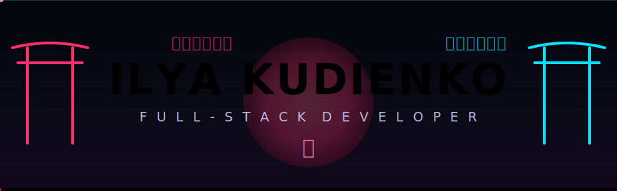

<!-- ╔══════════════════════════════════════════════════════════════╗ -->
<!--      ILYA KUDIENKO · ネオン侍 · neon samurai profile            -->
<!-- ╚══════════════════════════════════════════════════════════════╝ -->

<div id="header" align="center">

<!-- ===== Анимированный баннер (кастомный SVG) ===== -->


<!-- ===== Печатающийся подзаголовок ===== -->
<a href="https://github.com/Kudienko">
  
</a>

<br/>

<!-- ===== Соцсети ===== -->
<a href="https://t.me/fansel666">
  
</a>
<a href="https://www.linkedin.com/in/ikudienko/">
  
</a>
<a href="https://vk.com/fansel666">
  
</a>
<a href="https://www.instagram.com/livecreature">
  
</a>
<a href="mailto:fansel2002@gmail.com">
  
</a>

<br/><br/>


</div>

<br/>

<!-- ═══════════════════════ ABOUT ═══════════════════════ -->
### ⛩️ `about_me`

```ts
const ilya: FullStackDeveloper = {
  name:      "Ilya Kudienko",
  role:      "Full-Stack Developer",
  location:  "Tyumen, Russia 🇷🇺",
  code:      ["TypeScript", "JavaScript", "Python"],
  backend:   ["Node.js", "NestJS"],
  frontend:  ["React", "TypeScript"],
  english:   "B2",
  vibe:      "neon · samurai · clean architecture ⛩️",
};
```

<br/>

<!-- ═══════════════════════ TECH STACK ═══════════════════════ -->
<div align="center">

### 🚀 `tech_stack`

<br/>

**Frontend**


**Backend**


**Tools**


</div>

<br/>

<!-- ═══════════════════════ STATS ═══════════════════════ -->
<div align="center">

### 📊 `github_stats`

<br/>


<br/>


<br/><br/>


</div>

<br/>

<!-- ═══════════════════════ SNAKE ═══════════════════════ -->
<div align="center">

### 🐍 `contribution_snake`

<br/>

<picture>
  <source media="(prefers-color-scheme: dark)" srcset="https://raw.githubusercontent.com/Kudienko/Kudienko/output/github-snake-dark.svg" />
  <source media="(prefers-color-scheme: light)" srcset="https://raw.githubusercontent.com/Kudienko/Kudienko/output/github-snake.svg" />
  
</picture>

</div>

<br/>

<!-- ═══════════════════════ РУССКАЯ ВЕРСИЯ ═══════════════════════ -->
<details>
<summary>🇷🇺 <b>Русская версия</b></summary>

<br/>

### Обо мне

Привет! Я **Илья Кудиенко** — **фулл-стек разработчик** из Тюмени.

- 💻 **Языки:** TypeScript, JavaScript, Python
- ⚙️ **Бэкенд:** Node.js, NestJS
- 🎨 **Фронтенд:** React, TypeScript
- 🌐 **Английский:** B2
- ⛩️ **Вайб:** неон · самурай · чистая архитектура

### Стек

**Фронтенд:** React · TypeScript · JavaScript · HTML · CSS · Redux
**Бэкенд:** Node.js · NestJS · Express · Python · PostgreSQL · Prisma
**Инструменты:** Docker · Git · Linux · VS Code · Postman · Figma

### Контакты

- Telegram — [@fansel666](https://t.me/fansel666)
- LinkedIn — [in/ikudienko](https://www.linkedin.com/in/ikudienko/)
- VK — [fansel666](https://vk.com/fansel666)
- Instagram — [livecreature](https://www.instagram.com/livecreature)
- Email — [fansel2002@gmail.com](mailto:fansel2002@gmail.com)

</details>

<br/>

<!-- ═══════════════════════ ФУТЕР ═══════════════════════ -->
<div align="center">


</div>
